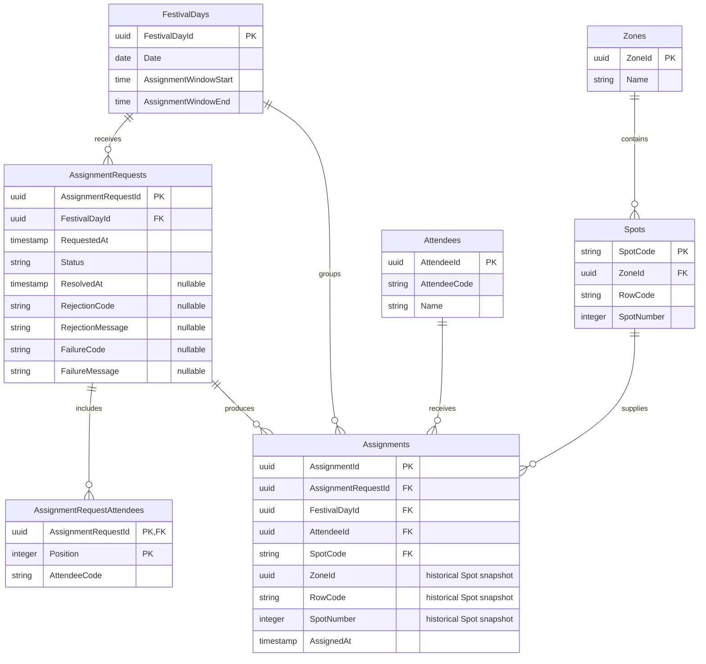

# PostgreSQL Relational Model

**Document version:** 1.0  
**Schema baseline:** `20260722174748_InitialCreate`

## Purpose

This document explains the versioned physical PostgreSQL persistence model for
Stage 3 of the Festival Assignment System. It is intended to help developers,
reviewers and business-aware technical stakeholders understand how the current
relational schema stores the assignment process and reinforces global
invariants.

## Source of truth

The Mermaid diagram is explanatory documentation. It is not a schema-definition
or schema-generation mechanism.

The source-of-truth chain remains:

```text
EF Core configuration
→ migrations
→ physical PostgreSQL schema
```

This version was prepared by comparing `FestivalDbContext`, every EF Core
configuration, the persistence-only models, the initial migration,
`FestivalDbContextModelSnapshot`, EF Core metadata and migration tests, and the
real PostgreSQL integration tests. Physical table and column names follow the
initial migration. For example, Domain properties named `Id` are stored as
`AttendeeId`, `FestivalDayId`, `ZoneId` and `AssignmentId`.

## Entity-relationship diagram

Every foreign key in this model is non-nullable. A child row therefore has
exactly one parent for each relationship, while the physical schema permits a
parent to have zero or many child rows.



## Table descriptions

### `Attendees`

Stores registered attendee master data. `AttendeeId` is the `uuid` primary key;
`AttendeeCode` is `character varying(32)` and `Name` is `character
varying(200)`. All columns are required.

The unique index `IX_Attendees_AttendeeCode` protects
`Attendees(AttendeeCode)`.

### `FestivalDays`

Stores a festival calendar day and its assignment window. `FestivalDayId` is
the `uuid` primary key; `Date` is `date`; `AssignmentWindowStart` and
`AssignmentWindowEnd` are `time without time zone`. All columns are required.

`AssignmentWindow` is embedded in these two columns. It is not a separate
table. The unique index `IX_FestivalDays_Date` protects
`FestivalDays(Date)`.

### `Zones`

Stores the physical zones that group Spots. `ZoneId` is the `uuid` primary key
and `Name` is required `character varying(100)`. Zone names are not unique in
the physical schema.

### `Spots`

Stores the current catalog of assignable physical positions. `SpotCode` is the
`character varying(32)` primary key. Required columns `ZoneId` (`uuid`),
`RowCode` (`character varying(16)`) and `SpotNumber` (`integer`) describe its
physical position. `ZoneId` references `Zones(ZoneId)`.

The unique index `IX_Spots_ZoneId_RowCode_SpotNumber` protects the physical
position `Spots(ZoneId, RowCode, SpotNumber)`.

### `AssignmentRequests`

Stores formal assignment requests and their processing outcomes. It is mapped
through the persistence-only `AssignmentRequestRow`; the Domain
`AssignmentRequest` aggregate is not directly mapped by EF Core.

`AssignmentRequestId` is the `uuid` primary key and `FestivalDayId` is a
required `uuid` foreign key to `FestivalDays(FestivalDayId)`. `RequestedAt` is
required `timestamp with time zone`; `Status` is required `character
varying(32)`. The outcome columns `ResolvedAt` (`timestamp with time zone`),
`RejectionCode` and `FailureCode` (`character varying(64)`), and
`RejectionMessage` and `FailureMessage` (`character varying(500)`) are
nullable.

The non-unique index
`IX_AssignmentRequests_FestivalDayId_RequestedAt` supports
`AssignmentRequests(FestivalDayId, RequestedAt)`.

### `AssignmentRequestAttendees`

Stores the attendee codes submitted with a formal request.
`AssignmentRequestId` is both a required `uuid` foreign key to
`AssignmentRequests(AssignmentRequestId)` and the first part of the composite
primary key. Required `Position` (`integer`) is its second part:
`(AssignmentRequestId, Position)`. `AttendeeCode` is required `character
varying(32)`.

`Position` preserves the original submitted attendee-code order. The unique
index
`IX_AssignmentRequestAttendees_AssignmentRequestId_AttendeeCode` protects
`AssignmentRequestAttendees(AssignmentRequestId, AttendeeCode)`.

### `Assignments`

Stores the final assignment of one Attendee to one Spot for one FestivalDay.
`AssignmentId` is the `uuid` primary key. `AssignmentRequestId`,
`FestivalDayId` and `AttendeeId` are required `uuid` foreign keys; `SpotCode`
is a required `character varying(32)` foreign key. `AssignedAt` is required
`timestamp with time zone`.

`SpotCode` references the assigned current `Spot` identity. Required `ZoneId`
(`uuid`), `RowCode` (`character varying(16)`) and `SpotNumber` (`integer`) are
a historical location snapshot. The snapshot preserves the represented
location independently from later changes to Spot configuration, while
`SpotCode` retains the relationship to the current catalog identity.

The table has these unique indexes:

- `IX_Assignments_FestivalDayId_SpotCode` on
  `Assignments(FestivalDayId, SpotCode)`;
- `IX_Assignments_FestivalDayId_AttendeeId` on
  `Assignments(FestivalDayId, AttendeeId)`;
- `IX_Assignments_AssignmentRequestId_AttendeeId` on
  `Assignments(AssignmentRequestId, AttendeeId)`.

## Global invariant indexes

### INV-01 — Spot uniqueness per FestivalDay

The unique index `Assignments(FestivalDayId, SpotCode)` prevents two committed
Assignments from using the same Spot during the same FestivalDay.

### INV-02 — Attendee uniqueness per FestivalDay

The unique index `Assignments(FestivalDayId, AttendeeId)` prevents one Attendee
from receiving more than one committed Assignment during the same FestivalDay.

### Request-level attendee uniqueness

The unique indexes `Assignments(AssignmentRequestId, AttendeeId)` and
`AssignmentRequestAttendees(AssignmentRequestId, AttendeeCode)` prevent an
Attendee or attendee code from being duplicated within the corresponding
request records.

These relational constraints reinforce Domain and Application rules. They are
the final protection against conflicting persisted state, but they do not
replace validation, orchestration or controlled error handling in those
layers.

## Check constraints

`CK_FestivalDays_AssignmentWindow_StartBeforeEnd` protects:

```text
AssignmentWindowStart < AssignmentWindowEnd
```

This is the only check constraint in the initial physical schema. Outcome-state
consistency for `AssignmentRequests` remains protected outside the database by
the current Domain and mapping behavior.

## Delete behavior

The approved cascade is:

```text
AssignmentRequests
→ AssignmentRequestAttendees
```

The attendee rows belong to the request and share its lifecycle, so deleting a
request deletes those rows.

All other application foreign keys are restrictive:

- `Spots(ZoneId) → Zones(ZoneId)`;
- `AssignmentRequests(FestivalDayId) → FestivalDays(FestivalDayId)`;
- `Assignments(AssignmentRequestId) → AssignmentRequests(AssignmentRequestId)`;
- `Assignments(FestivalDayId) → FestivalDays(FestivalDayId)`;
- `Assignments(AttendeeId) → Attendees(AttendeeId)`;
- `Assignments(SpotCode) → Spots(SpotCode)`.

Restrictive deletion prevents referenced master and historical records from
being silently removed by cascade. The `TRUNCATE ... CASCADE` used to isolate
PostgreSQL integration tests is test cleanup only; it is not a production
delete policy.

## Persistence design decisions

### AssignmentRequest persistence separation

`AssignmentRequestRow` and `AssignmentRequestAttendeeRow` are persistence
models. A mapper converts the complete Domain aggregate to these rows and
reconstructs it from them. The Domain `AssignmentRequest` is not directly
mapped by EF Core.

### AssignmentWindow ownership

`AssignmentWindow` is a Domain Value Object owned by `FestivalDay`. It is
stored as the embedded `AssignmentWindowStart` and `AssignmentWindowEnd`
columns in `FestivalDays`; no separate table exists.

### Historical Spot snapshot

`Assignments` stores `ZoneId`, `RowCode` and `SpotNumber` as historical
location data. `SpotCode` remains the foreign key to the current Spot identity.
This separates the recorded assignment location from later Spot configuration
changes.

### Explicit index policy

`FestivalDbContext` removes EF Core's `ForeignKeyIndexConvention`. Foreign-key
indexes are evaluated explicitly and must respond to a protected invariant, a
known query or a demonstrated relational requirement.

Dedicated indexes on `Assignments(AttendeeId)` and
`Assignments(SpotCode)` remain deferred until repository query patterns
justify them.

### Durable persistence boundary

The PostgreSQL repositories map and stage new request and Assignment state in a
shared `FestivalDbContext`; they do not call `SaveChanges` themselves.
`EfCoreUnitOfWork`, implementing the Application `IUnitOfWork` port, confirms
all pending state with one `FestivalDbContext.SaveChangesAsync` call. That
single EF Core save is the current atomic persistence boundary, with transaction
ownership left to EF Core and no manual transaction API.

`ProcessAssignmentRequestUseCase` now stages the final request outcome and any
Assignments before invoking `IUnitOfWork.SaveChangesAsync` exactly once.
Completed and Rejected flows are validated through a separate context against
real PostgreSQL. `AddPostgreSqlPersistence` registers all PostgreSQL adapters
and the Unit of Work as scoped services; the API demo still explicitly selects
its separate in-memory configuration.

At this boundary, Infrastructure translates only PostgreSQL unique violations
with SQLSTATE `23505` and one of the exact assignment index names into stable
Application conflicts: Spot already assigned for a FestivalDay, Attendee already
assigned for a FestivalDay, or duplicate Attendee Assignment within an
AssignmentRequest. Unknown constraints and other errors continue propagating.
The use case does not convert these exceptions into result statuses.

Real PostgreSQL tests confirm that a recognized conflict during the single save
leaves no durable row from the new `AssignmentRequest`, its attendee rows or its
Assignments. Verification uses a separate context; the failed scoped context is
discarded and is not repaired or retried. API mapping and concurrency validation
remain pending.

## Diagram limitations

Mermaid ER diagrams do not fully express all compound unique indexes, check
constraints, delete behaviors, provider-specific relational types,
transaction boundaries, Domain Aggregate boundaries or concurrency behavior.
Those concerns are documented in the surrounding text and validated through
EF Core configuration, migrations, metadata tests and PostgreSQL integration
tests.

## Related documentation

- [Stage 3 persistence model and transactional boundary](../stage-3-persistence-model-and-transaction-boundary.md)
- [ADR 0001: Select the MVP database engine](../adr/0001-select-mvp-database-engine.md)
- [README](../../README.md)
- [EF Core persistence model](../../src/Festival.Infrastructure/Persistence/)
- [Initial PostgreSQL migration](../../src/Festival.Infrastructure/Persistence/Migrations/20260722174748_InitialCreate.cs)
